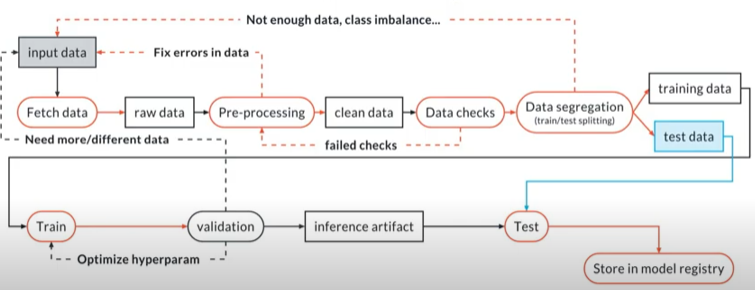

# Build an ML Pipeline for Short-Term Rental Prices in NYC

You are working for a property management company renting rooms and properties for short periods of 
time on various rental platforms. You need to estimate the typical price for a given property based 
on the price of similar properties. Your company receives new data in bulk every week. The model needs 
to be retrained with the same cadence, necessitating an end-to-end pipeline that can be reused.

The goal of this project is to make the end-to-end machine learning pipeline in a production-ready manner, which means that the object to be deployed is ready to be consumed by customers.

## Setup

This pipeline can be almost entirely run on it's own, you'll just need to setup 4 things:

- [weights and biases](wandb.ai/)
- [conda](https://docs.conda.io/projects/conda/en/latest/user-guide/install/)
- [python 3](https://www.python.org/downloads/)
- [git](https://git-scm.com/downloads)

Please install python3, conda and git by following the instruction in the bullet links. Next we will setup the conda development environment and your Weights and Biases authorization.

### Cloning the Repo

You can get a local copy of the repository by using the following command:

```
git clone https://github.com/leouchoa/udacity_mlops_nycAirbnb_short_term_rental.git
```

After that step into the `udacity_mlops_nycAirbnb_short_term_rental` folder.

### Conda Environment Creation

Make sure to have conda installed and ready, then create the development environment using the `environment.yml` file provided in the root of the repository and activate it:

```
conda env create -f environment.yml
conda activate nyc_airbnb_dev
```

### Get API key for Weights and Biases

Let's make sure we are logged in to Weights & Biases. Get your API key from W&B by going to [https://wandb.ai/authorize](https://wandb.ai/authorize) and click on the + icon (copy to clipboard), then paste your key into this command:
```
> wandb login [your API key]
```
You should see a message similar to:
```
wandb: Appending key for api.wandb.ai to your netrc file: /home/[your username]/.netrc
```

## Pipeline Snapshot

The pipeline constructed will work in a similar fashion to the one describe in the picture bellow and it can be described in 7 steps:

1. Fetch data
2. Pre-processing
3. Data checks
4. Data segregation (train/validation/test split)
5. Model training and selection
6. Model testing
7. Deployment



## How to Use 

The 7 pipeline steps are present in the `src` and `components` folders. The `src` is has 4 major steps: 

a. `eda`: the exploratory data analysis used to understand data and discover important feature engineering strategies.
b. `basic_cleaning`: data treatment step necessary to fix or remove problematic data points.
c. `data_check`: testing of the data treatment step, necessary to ensure that the basic cleaning step went as expected.
d. `train_random_forest`: encompasses data segregation and model training.

while the `components` folder has some subtasks of `train_random_forest` and also the data fetching step. 

To make the entire pipeline run automatically you can use:

```
mlflow run .
```

but you can also call individual steps with

```
mlflow run . -P steps="your_desired_step_here"
```

which are "download", "basic_cleaning", "data_check", "data_split", "train_random_forest" (described in [`main.py`](https://github.com/leouchoa/udacity_mlops_nycAirbnb_short_term_rental/blob/master/main.py)). So for example to run the "download" step use:
 
 ```
mlflow run . -P steps="download"
```

and to run multiple steps you can, for example run:

```
mlflow run . -P steps="download,basic_cleaning,data_check"
```


# Topics to be added to the README file

- Introduction
- How to use
  - dependencies
    - wandb login (API key)
    - conda
    - python
    - git
  - running
    - run whole pipeline
    - run parts of the pipeline
    - run from github
- mlflow errors in env
- deploying the model 
  - online
  - offline
  - docker image
- Next steps
  - cite optuna do hyperparam optimization
  - cite great expectations for testing
  - adding more models to the training scope
  - improve: model/eda/
